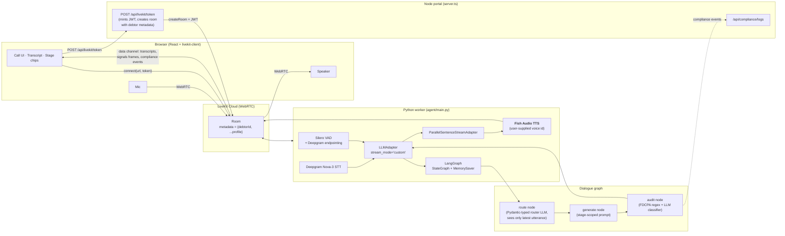
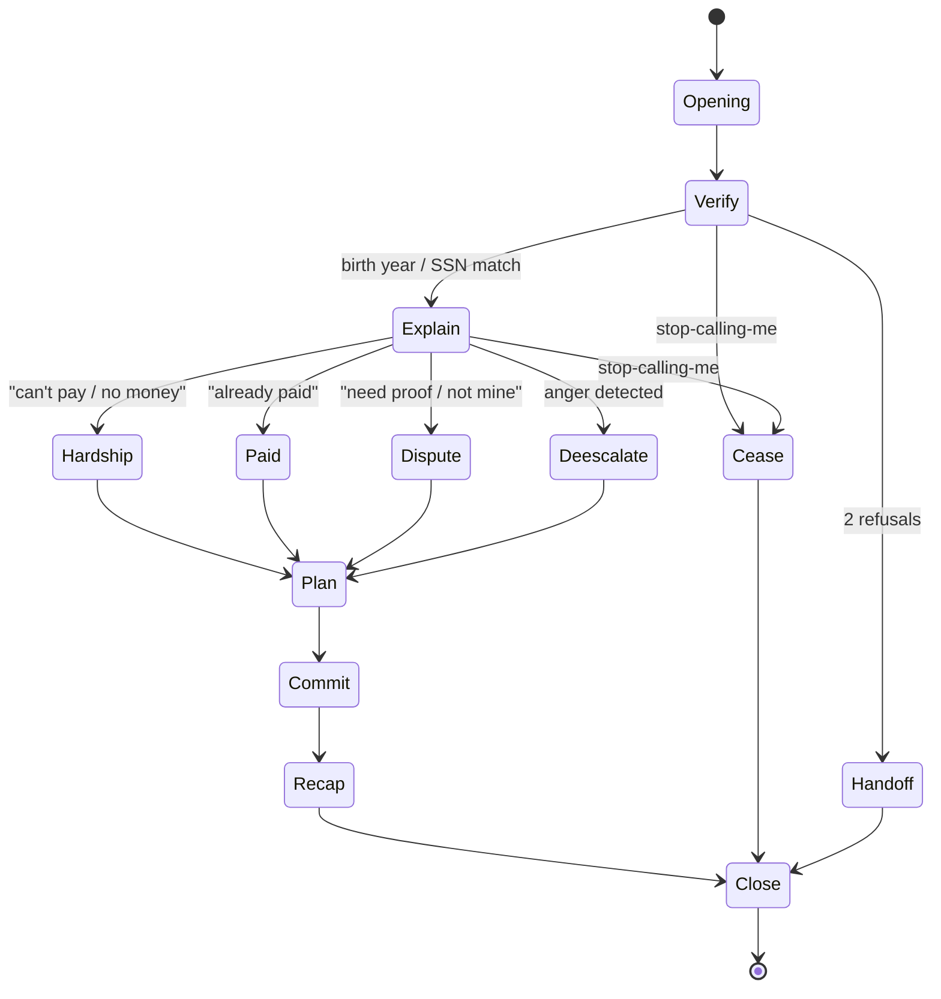

# Fish Recovery

> A real-time, FDCPA-compliant debt-collection voice agent — voiced by **Fish Audio TTS**.

Meet **Rissa**: a voice agent that picks up the phone, introduces herself, verifies a debtor, handles objections (hardship, dispute, already-paid), proposes a payment plan, and confirms the agreement — without ever saying something the FDCPA forbids. Every reply runs through a compliance gate before it reaches Fish Audio for synthesis.

The TTS is the centerpiece. Swap the voice by changing **one environment variable** — no code edits, no restart of anything besides the worker.

---

## Contents

- [Demo](#demo)
- [Tech stack](#tech-stack)
- [Quick start](#quick-start)
- [**Setting up Fish Audio TTS**](#setting-up-fish-audio-tts) ← the bit you probably came for
- [Environment variables](#environment-variables)
- [How it's wired](#how-its-wired)
- [The dialogue graph](#the-dialogue-graph)
- [Compliance design](#compliance-design)
- [Tested scenarios](#tested-scenarios)
- [Project layout](#project-layout)
- [Design decisions](#design-decisions)
- [Limitations and roadmap](#limitations-and-roadmap)
- [License](#license)

---

## Demo

A live call goes: **dial → opening → identity verification → objection handling → payment plan → commit → recap → close**, all in roughly 60 seconds of conversation. Rissa's voice is whatever Fish Audio voice ID you wire up — the same agent can sound warm, brisk, formal, or anything in between by swapping `FISHAUDIO_VOICE_ID`.

The browser UI shows a live transcript drawer, stage / emotion / identity chips driven by graph state, and a glass-pill dock for call controls. There is no separate transcript heuristic on the frontend: every chip reads from a `signals` frame that the worker publishes straight out of the LangGraph checkpointer.

---

## Tech stack

| Layer | Choice | Why |
|---|---|---|
| **Text-to-speech** | **Fish Audio TTS** via `livekit-plugins-fishaudio` | Sub-second time-to-first-audio, voice-id-driven swaps, no Vertex / GCP service-account pain |
| Speech-to-text | Deepgram Nova-3 (interim, `endpointing_ms=25`, `no_delay`) | Lowest STT latency available on the v1 LiveKit plugin lineup |
| VAD + turn detection | Silero VAD + Deepgram endpointing | No ONNX turn detector — fewer moving parts, less perceived lag |
| Dialogue LLM (router + generator) | Gemini 3.5 Flash via `langchain-google-genai` | Cheap, fast, structured-output-native via Pydantic |
| Dialogue state machine | LangGraph `StateGraph` + `MemorySaver` | Per-room checkpointing keyed on `thread_id = ctx.room.name` |
| LLM ↔ LiveKit bridge | `livekit-plugins-langchain.LLMAdapter(stream_mode="custom")` | Stock adapter — no custom WebSocket plumbing |
| Real-time transport | LiveKit Cloud (WebRTC) | Owns audio, signaling, room metadata, data channel |
| TTS pipelining | `ParallelSentenceStreamAdapter` (max 4) | Overlaps per-sentence Fish Audio synthesis; cuts time-to-first-audio noticeably |
| Compliance gate | Regex layer + Gemini classifier fallback in `agent/compliance.py` | Runs as a graph node, not a microservice |
| Frontend | React 19 + Vite 6 + Tailwind 4 + `livekit-client` | Direct `Room` object so we can subscribe to the custom data channel ourselves |
| Token portal | Express + `livekit-server-sdk` | Mints JWTs and pre-creates rooms with debtor profile in `metadata` |

---

## Quick start

```bash
git clone https://github.com/YillonMask/voice-agent-test-fishaudio.git
cd voice-agent-test-fishaudio

# Fill in your keys (see "Setting up Fish Audio TTS" below for FISHAUDIO_*)
cp .env.example .env
$EDITOR .env

# One command creates a venv, installs Python + Node deps, and launches
# both the portal and the Python LiveKit worker in parallel.
./startup.sh

# Open the dashboard
open http://localhost:47821
```

First run takes ~2 minutes (deps + venv). Subsequent runs start in seconds. To stop both processes, hit `Ctrl-C` in the terminal running `startup.sh`. Logs go to `.logs/portal.log` and `.logs/agent.log`.

Requires **Python ≥ 3.11** (LangGraph's `get_stream_writer` uses contextvars that only propagate correctly on 3.11+ for async code) and **Node ≥ 20**.

---

## Setting up Fish Audio TTS

This project uses Fish Audio for every word the agent says aloud. There are exactly two pieces of information to wire up: an API key and a voice reference ID.

### 1. Get your API key

1. Sign in at [https://fish.audio](https://fish.audio).
2. Open your account → **API Keys** (top-right account menu).
3. Create a new key and copy it. Treat it like any other secret — `.env` is gitignored in this repo.

```bash
# in .env
FISHAUDIO_API_KEY=fk_xxxxxxxxxxxxxxxxxxxxxxxxxxxxxxxx
```

### 2. Pick a voice and copy its reference ID

Fish Audio's voice catalog lives at [https://fish.audio/text-to-speech](https://fish.audio/text-to-speech).

1. Filter by **language** (the agent is currently English-only — the prompts and FDCPA regex assume English), **gender**, **style**, or **age** to narrow the list.
2. Click a voice card to preview it. The preview plays the text you type in the box at the top — useful for hearing how the voice handles your actual scripts.
3. Once you've settled on a voice, **copy its reference ID** from the URL or the voice's detail page. It looks like a 32-character hex string, for example:

   ```
   9a9cf47702da476aa4629e2506d4a857
   ```

4. Drop it into `.env`:

```bash
# in .env
FISHAUDIO_VOICE_ID=9a9cf47702da476aa4629e2506d4a857
```

### 3. (Optional) Tune for latency vs. quality

The TTS factory in `agent/main.py` constructs Fish Audio with these defaults:

```python
fishaudio.TTS(
    api_key=os.environ["FISHAUDIO_API_KEY"],
    voice_id=os.environ["FISHAUDIO_VOICE_ID"],
    latency_mode="balanced",   # ← change here
    sample_rate=24000,
)
```

If you need the absolute fastest first-audio, lower `latency_mode` toward the plugin's lowest-latency setting. If you want the most natural prosody and don't mind a slightly longer initial delay, raise it. Defaults already feel snappy in practice; only touch this if a specific voice makes you want to.

The TTS is also wrapped in a `ParallelSentenceStreamAdapter` (see `agent/parallel_tts.py`) that kicks off synthesis for sentence N+1 as soon as sentence N's boundary is detected. With a chatty agent, this typically halves perceived latency compared to strictly-sequential per-sentence synthesis.

### 4. Swap voices without restarting the Node portal

Voice changes only require restarting the **Python worker**, not the portal. If you want to A/B two voices fast:

```bash
# In one terminal
FISHAUDIO_VOICE_ID=<voice-A> python -m agent.main dev

# Ctrl-C, then
FISHAUDIO_VOICE_ID=<voice-B> python -m agent.main dev
```

The browser stays connected; the next call uses the new voice.

---

## Environment variables

See [`.env.example`](./.env.example) for the full template.

| Variable | Required | What for |
|---|---|---|
| `FISHAUDIO_API_KEY` | ✅ | Fish Audio API key |
| `FISHAUDIO_VOICE_ID` | ✅ | Fish Audio reference voice ID |
| `LIVEKIT_URL` | ✅ | Your LiveKit Cloud or self-hosted URL (`wss://…`) |
| `LIVEKIT_API_KEY` | ✅ | LiveKit API key |
| `LIVEKIT_API_SECRET` | ✅ | LiveKit API secret |
| `VITE_LIVEKIT_URL` | ✅ | Same URL as `LIVEKIT_URL`, exposed to the browser bundle |
| `GOOGLE_API_KEY` | ✅ | Gemini API key for router + generator LLMs |
| `DEEPGRAM_API_KEY` | ✅ | Deepgram Nova-3 STT |
| `GEMINI_MODEL` | — | LLM model id, defaults to `gemini-3.5-flash` |
| `GEMINI_ROUTER_MODEL` | — | Router model id, defaults to `GEMINI_MODEL` |
| `PORT` | — | Node portal port, defaults to `47821` |

---

## How it's wired



The portal **never touches audio**. It mints a JWT, pre-creates the LiveKit room with the debtor profile in `metadata`, and serves the React bundle. The Python worker auto-dispatches into the room, reads `ctx.room.metadata`, and seeds the per-room `CallState`. Every user turn flows `Deepgram → LLMAdapter → route → generate → audit → ParallelSentenceStreamAdapter → Fish Audio → speaker`. State persists across turns via LangGraph's `MemorySaver`, keyed on `thread_id = ctx.room.name`.

After each assistant turn, the worker reads the checkpointer and publishes a `signals` data frame — `{stage, identity_verified, emotion, objection, verify_attempts, cease_requested, must_handoff}` — and the UI's chips read from that, not from transcript scanning.

---

## The dialogue graph



Stage routing happens in `agent/router.py::classify_turn` — an isolated Gemini 3.5 Flash call with a Pydantic `Route` schema that sees **only the latest user utterance** plus state booleans (no conversation history → a hard prompt-injection boundary). The `route` node consumes the typed result and writes:

1. `next_stage` — chosen by the router; overridden to `cease` whenever `wants_cease=true`, and auto-escalated to `handoff` after 3 failed verify attempts.
2. `identity_verified`, `cease_requested` — sticky-ORed with the prior value, so once true, always true.
3. `emotion`, `objection` — interpretive reads of the user's tone and intent for this turn (surfaced in the UI).

---

## Compliance design

The `agent/compliance.py` module is the only thing standing between the LLM and the user's ear. Five rules from `RULES`:

- ❌ Arrest, jail, or prosecution threats
- ❌ Wage-garnishment threats the collector cannot legally deliver
- ❌ Third-party disclosure of the debt
- ❌ Credit-score threats
- ❌ Abusive, sarcastic, or condescending language

The pipeline is a **regex layer first** (cheap, deterministic), then a **Gemini classifier** as a fallback for cases the regex misses. The audit runs as a node in the same LangGraph, post-generation. A planned upgrade (see roadmap) moves it to a pre-emit rewrite gate that only the post-audit text is allowed to reach TTS.

---

## Tested scenarios

```bash
python -m agent.tests.test_graph_e2e
```

The test drives the **real compiled LangGraph** through scripted full conversations against the real Gemini 3.5 Flash backend. The only mock is the WebRTC transport — the brain itself runs end-to-end.

Latest run: **6/6 PASS** (~90s wall time, 2–6s per turn on Gemini 3.5 Flash).

| Scenario | Debtor | Stage path observed | Verified | Objection | Result |
|---|---|---|---|---|---|
| `hardship_john_smith` | John Smith (#1) | opening → verify → explain → hardship → plan → commit | ✅ | `no_money` | ✅ PASS |
| `dispute_emily_davis` | Emily Davis (#2) | opening → verify → explain → dispute → dispute | ✅ | `need_proof` | ✅ PASS |
| `already_paid_marcus_vance` | Marcus Vance (#3) | opening → verify → explain → paid → plan | ✅ | `already_paid` | ✅ PASS |
| `cease_and_desist` | John Smith (#1) | opening → verify → **cease** (honored pre-verification) | — | `refuse` | ✅ PASS |
| `verify_refusal_then_handoff` | Emily Davis (#2) | opening → verify → verify → handoff | — | — | ✅ PASS |
| `compliance_regex` | — | 6 hand-crafted candidates, 5 violations | — | — | ✅ PASS |

Assertions per turn (all scenarios):
- Agent produces non-empty text on every turn
- No agent utterance triggers any FDCPA regex pattern
- No post-audit compliance flags are raised

Assertions per scenario (whole conversation):
- Identity verifies at the expected turn
- Detected objection matches the script
- Stage milestones appear in the expected order

---

## Project layout

```
.
├── agent/                          Python LiveKit worker
│   ├── main.py                     Entrypoint: AgentSession + Fish Audio TTS + signals publisher
│   ├── graph.py                    StateGraph compilation (route → generate → audit)
│   ├── state.py                    CallState TypedDict
│   ├── router.py                   Pydantic-typed Gemini classifier (Route schema)
│   ├── nodes.py                    route + generate + audit + per-stage prompts (Rissa persona)
│   ├── parallel_tts.py             ParallelSentenceStreamAdapter (overlaps Fish Audio synthesis)
│   ├── compliance.py               FDCPA regex layer + LLM classifier
│   ├── llm.py                      ChatGoogleGenerativeAI factory
│   ├── debtors.py                  Demo debtor profiles (mirror of src/data.ts)
│   ├── requirements.txt
│   └── tests/test_graph_e2e.py     End-to-end graph test
├── server.ts                       Node portal: /api/livekit/token, /api/compliance/logs
├── src/                            React frontend
│   ├── App.tsx                     LiveKit room + transcript + signals consumer
│   ├── components/                 AmbientOrb, AudioVisualizer, LogDrawer, InfoChips, …
│   ├── data.ts                     Debtor profiles for the UI
│   └── types.ts
├── startup.sh                      One-shot venv + deps + portal + worker launcher
├── .env.example                    Credentials template
├── package.json
└── tsconfig.json
```

---

## Design decisions

A few things this codebase **intentionally does not build**, because the underlying platforms already do them and re-implementing only adds latency and bugs:

- ❌ Custom WebSocket layer to TTS — `livekit-plugins-fishaudio` handles it
- ❌ Custom turn-detection ONNX model — VAD + Deepgram endpointing is the source of truth
- ❌ Custom interruption handling — `AgentSession` cancels TTS + LLM mid-stream
- ❌ Custom sentence chunking before TTS — `ParallelSentenceStreamAdapter` only parallelises synthesis; chunking stays in `tts_node`
- ❌ Separate compliance microservice — it's a node in the graph
- ❌ Stage routing via regex — the router LLM in `agent/router.py` owns it
- ❌ Monolithic dialogue prompt — every stage has a scoped prompt in `agent/nodes.py`
- ❌ Frontend transcript heuristics — the UI consumes `signals` frames straight from the checkpointer

---

## Limitations and roadmap

- **Negotiation math is the LLM, not policy.** The `plan` stage prompt says "propose a concrete amount and date based on the conversation so far" — Gemini picks the number. For a production deployment, I'd add `min_settle_pct`, `max_term_months`, and `credit_band` to the `DebtorProfile` and compute the offer in Python before letting the LLM phrase it.
- **Pre-emit compliance rewrite loop.** `compliance.py` already implements the regex layer, LLM classifier, rewrite cap, and canned safe fallback. The graph currently wires it as a post-hoc audit; making it a strict pre-emit gate requires switching `LLMAdapter(stream_mode="updates")` and adding a verbatim-replay speak node.
- **Postgres audit trail.** The compliance ledger lives in-memory in `server.ts`. Plug in `langgraph.checkpoint.postgres.PostgresSaver` when promoting beyond demo.
- **English only.** Prompts, FDCPA regex, and the router schema all assume English. Multilingual support needs a per-language compliance rule set, not just a model swap.

---

## License

Private demo. Not for production deployment without a real legal review of the prompt library and compliance ruleset.
