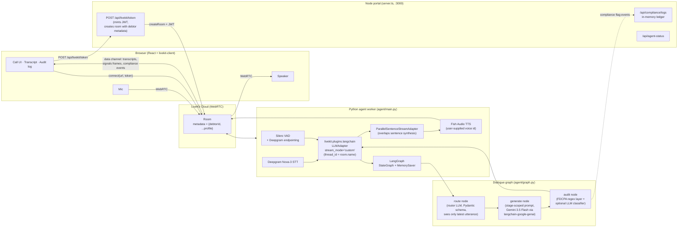
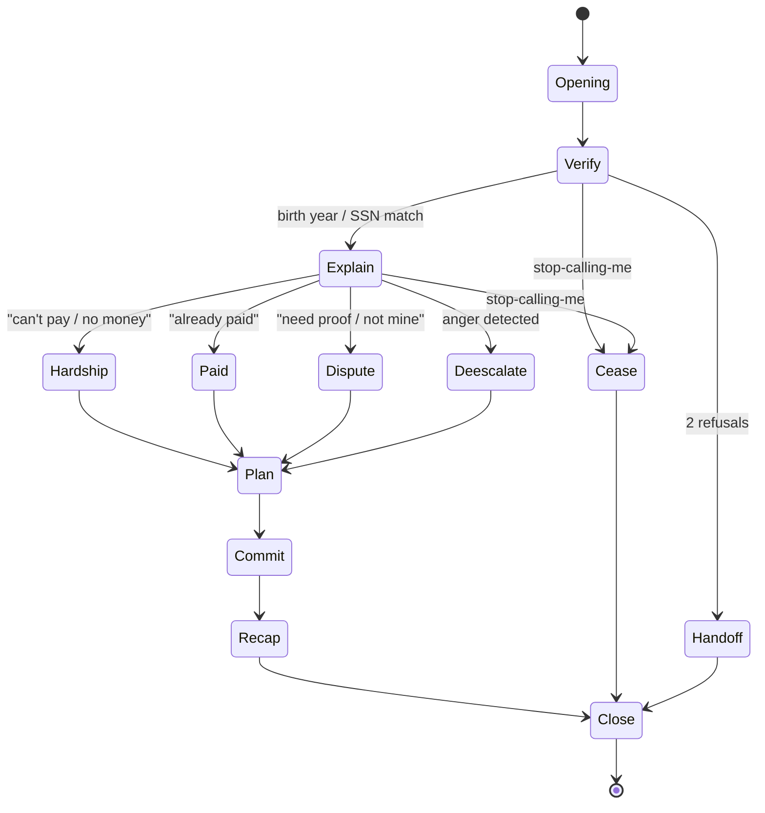

# Fish Recovery — FDCPA-Compliant Debt-Collection Voice Agent

A real-time voice agent that conducts FDCPA-compliant debt-collection calls.
LiveKit Agents own the audio loop, a LangGraph state machine owns the
dialogue, Gemini 3.5 Flash owns the language, and an in-graph compliance
node enforces FDCPA §805/§806/§807 before anything reaches text-to-speech.

## How the pipeline is orchestrated



The Node portal never sees audio; it mints a JWT, pre-creates the LiveKit
room with debtor profile in `metadata`, and serves the React UI. The Python
worker auto-dispatches into the room, reads the debtor profile from
`ctx.room.metadata`, and seeds the per-room CallState. Every user turn flows
through `Deepgram → LLMAdapter → route → generate → audit → TTS → speaker`,
with state persisted across turns by LangGraph's `MemorySaver` keyed on
`thread_id = ctx.room.name`. After each assistant turn, the worker reads
the checkpointer and publishes a `signals` data frame (stage, identity,
emotion, objection, attempts) so the UI mirrors the graph's real state
without scanning transcripts.

## Inside the dialogue graph



Stage routing happens in `agent/router.py::classify_turn` — an isolated
Gemini 3.5 Flash call with a Pydantic `Route` schema that sees ONLY the
latest user utterance plus state booleans (no conversation history → a
hard prompt-injection boundary). The `route` node in `agent/nodes.py`
consumes the typed result and writes:

1. `next_stage` — chosen by the router; overridden to `cease` whenever
   `wants_cease` is true, and auto-escalated to `handoff` after 3 failed
   verify attempts.
2. `identity_verified`, `cease_requested` — sticky-ORed with the prior
   value so once true, always true.
3. `emotion`, `objection` — interpretive reads of the user's tone and
   intent for this turn (surfaced in the UI's Debtor Read card).

## Tech stack

| Layer | Component | Source |
|---|---|---|
| WebRTC + audio loop | LiveKit Agents v1.5+ (preemptive generation, automatic interruption) | `livekit-agents` |
| Voice activity detection | Silero VAD | `livekit-plugins-silero` |
| Turn detection | VAD + Deepgram endpointing (no ONNX turn detector) | `livekit-plugins-deepgram` |
| STT | Deepgram Nova-3 (`interim_results`, `endpointing_ms=25`, `no_delay`) | `livekit-plugins-deepgram` |
| LLM adapter | `LLMAdapter(graph=…, stream_mode="custom")` | `livekit-plugins-langchain` |
| Dialogue state machine | `StateGraph` + `MemorySaver` checkpointer | `langgraph` |
| Router LLM | `gemini-3.5-flash` w/ `with_structured_output(Route)`, `thinking_budget=0` | `agent/router.py` |
| Generator LLM | `gemini-3.5-flash`, streamed via `get_stream_writer()` | `agent/nodes.py::generate` |
| Compliance gate | FDCPA regex layer + Gemini classifier fallback | `agent/compliance.py` |
| TTS | Fish Audio TTS, user-supplied `FISHAUDIO_VOICE_ID` | `livekit-plugins-fishaudio` |
| TTS adapter | `ParallelSentenceStreamAdapter` (overlaps per-sentence synthesis) | `agent/parallel_tts.py` |
| Frontend | React 19 + Vite 6 + Tailwind 4 + `livekit-client` | `package.json` |
| Token issuer | Express + `livekit-server-sdk` | `server.ts` |

## File layout

```
.
├── agent/                          Python LiveKit worker
│   ├── main.py                     entrypoint: AgentSession + LLMAdapter + Vertex TTS + signals publisher
│   ├── graph.py                    StateGraph compilation (route → generate → audit) + MemorySaver
│   ├── state.py                    CallState TypedDict (messages + business state)
│   ├── router.py                   isolated Pydantic-typed Gemini classifier (Route schema)
│   ├── nodes.py                    route + generate + audit + per-stage prompt builders
│   ├── parallel_tts.py             ParallelSentenceStreamAdapter (overlaps sentence synthesis)
│   ├── compliance.py               FDCPA regex layer + LLM classifier + rewrite cap
│   ├── llm.py                      ChatGoogleGenerativeAI factory (Gemini 3.5 Flash)
│   ├── debtors.py                  debtor profile lookup (mirror of src/data.ts)
│   ├── requirements.txt
│   ├── README.md
│   └── tests/
│       └── test_graph_e2e.py       end-to-end graph test (real Gemini calls)
├── server.ts                       Node portal: /api/livekit/token, /api/compliance/logs
├── src/                            React frontend
│   ├── App.tsx                     LiveKit room + transcript + signals consumer
│   ├── components/
│   │   ├── InfoChips.tsx           StageChip 3-card hover cascade (Pipeline / Read / Identity)
│   │   ├── AmbientOrb.tsx          backdrop, emotion-biased palette
│   │   ├── AudioVisualizer.tsx     centerpiece canvas orb, emotion-tinted on listening + user
│   │   └── …
│   ├── data.ts                     debtor profiles for the UI
│   └── types.ts
├── startup.sh                      unified entry: venv + deps + Node + Python in parallel
├── .env.example                    template for credentials
├── package.json
└── tsconfig.json
```

## Quick start

```bash
# 1. Fill in .env (use .env.example as a template). At minimum:
#    LIVEKIT_URL, LIVEKIT_API_KEY, LIVEKIT_API_SECRET,
#    GOOGLE_API_KEY, DEEPGRAM_API_KEY

# 2. One command starts everything (creates venv + installs deps on first run):
./startup.sh

# 3. Open the portal:
open http://localhost:3000

# 4. Watch the live logs (in another terminal):
tail -f .logs/portal.log .logs/agent.log
```

To stop both processes: `Ctrl-C` in the `startup.sh` terminal.

## Tested scenarios

Run `python -m agent.tests.test_graph_e2e` from the active venv. The test
drives the **real compiled LangGraph** through scripted full conversations
against the real Gemini 3.5 Flash backend; it does not mock anything except
the WebRTC transport (which is the bit being orchestrated, not the brain).

Latest run: **6/6 PASS** (~90s wall time, 2–6s per turn on Gemini 3.5 Flash).

| Scenario | Debtor | Stage path observed | Verified | Objection | Result |
|---|---|---|---|---|---|
| `hardship_john_smith` | John Smith (#1) | opening → verify → explain → hardship → plan → commit | ✅ | `no_money` | ✅ PASS |
| `dispute_emily_davis` | Emily Davis (#2) | opening → verify → explain → dispute → dispute | ✅ | `need_proof` | ✅ PASS |
| `already_paid_marcus_vance` | Marcus Vance (#3) | opening → verify → explain → paid → plan | ✅ | `already_paid` | ✅ PASS |
| `cease_and_desist` | John Smith (#1) | opening → verify → **cease** (honored pre-verification) | — | `refuse` | ✅ PASS |
| `verify_refusal_then_handoff` | Emily Davis (#2) | opening → verify → verify → handoff | — | — | ✅ PASS |
| `compliance_regex` | — | 6 hand-crafted candidates, 5 violations | — | — | ✅ PASS |

The compliance unit covers the five rules in `agent/compliance.py::RULES`:
arrest/jail threats, wage-garnishment threats, third-party disclosure, credit-score
threats, and abusive language.

Per-turn assertions across every scenario:
- Agent produces non-empty text on every turn.
- No agent utterance triggers any FDCPA regex pattern.
- No post-audit compliance flags are raised.

Whole-conversation assertions (per scenario):
- Identity verifies at the expected turn.
- Detected objection matches the scripted scenario.
- Stage milestones appear in the expected order.

## Environment

See [`.env.example`](./.env.example). Key knobs:

| Variable | Purpose |
|---|---|
| `LIVEKIT_URL` / `LIVEKIT_API_KEY` / `LIVEKIT_API_SECRET` | LiveKit Cloud or self-hosted credentials |
| `GOOGLE_API_KEY` | Gemini API key for `langchain-google-genai` (router + generator LLM) |
| `FISHAUDIO_API_KEY` | Fish Audio API key |
| `FISHAUDIO_VOICE_ID` | Fish Audio reference voice id (from https://fish.audio/text-to-speech) |
| `DEEPGRAM_API_KEY` | Deepgram Nova-3 STT |
| `GEMINI_MODEL` | LLM model id, defaults to `gemini-3.5-flash` |
| `GEMINI_ROUTER_MODEL` | Router model id, defaults to `GEMINI_MODEL` |
| `PORT` | Node portal port (defaults to 3000) |

## What this codebase intentionally does *not* build

LiveKit and its plugins already do these — re-building them would only add
latency and bugs:

- ❌ Custom WebSocket layer to TTS — the `livekit-plugins-fishaudio` plugin handles it
- ❌ Custom turn detection ONNX model — VAD + Deepgram endpointing is the source of truth
- ❌ Custom interruption handling — `AgentSession` cancels TTS + LLM mid-stream
- ❌ Custom sentence-chunking before TTS — `ParallelSentenceStreamAdapter` only parallelises synthesis; chunking stays in `tts_node`
- ❌ Separate compliance microservice — it is a node in the graph
- ❌ Stage routing via regex — the router LLM in `agent/router.py` owns it
- ❌ Monolithic dialogue prompt — every stage has a scoped prompt in `agent/nodes.py`
- ❌ Frontend transcript heuristics — the UI consumes `signals` frames straight from the checkpointer

## Known deferred work

- **Pre-emit compliance rewrite loop.** The `agent/compliance.py` module
  fully implements the regex layer, LLM classifier, rewrite cap, and canned
  safe fallback. The graph wires it as a post-hoc audit; the strict pre-emit
  rewrite gate would require switching `LLMAdapter(stream_mode="updates")`
  and adding a verbatim-replay speak node. Tracked separately.
- **Postgres audit trail** — currently in-memory in `server.ts`. Plug in
  `langgraph.checkpoint.postgres.PostgresSaver` when promoting beyond demo.

## License

Private demo. Not for production use without a real legal review of the
prompt library and compliance ruleset.
