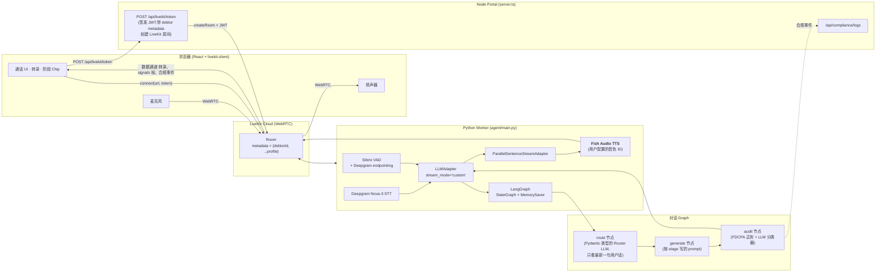
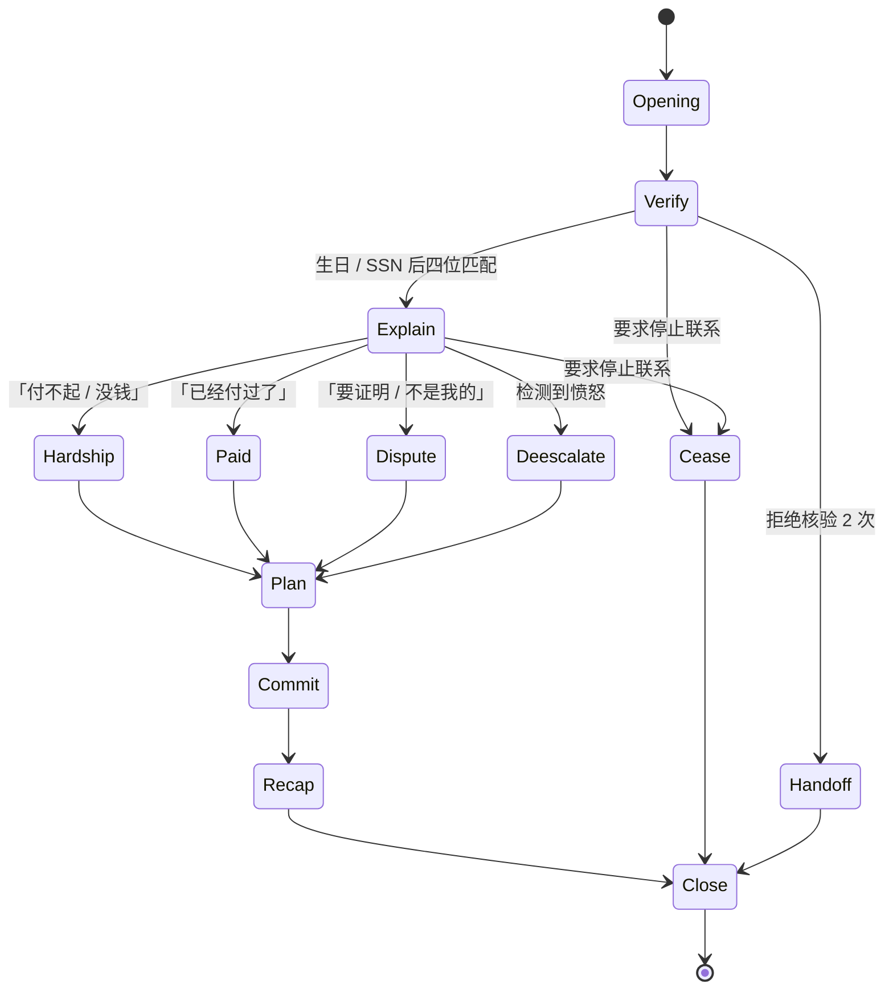

# Fish Recovery

[English](./README.md) · **简体中文**

> 一个实时、符合 FDCPA 合规要求的债务催收语音 Agent —— 由 **Fish Audio TTS** 提供发声。

认识一下 **Rissa**:她会接通电话、自我介绍、核实债务人身份、处理常见抗辩(经济困难、争议、声称已支付)、提出还款方案,并最终确认协议 —— 而且整个过程不会说出任何 FDCPA 禁止的话。每一句回复在送入 Fish Audio 合成之前,都会先经过一道合规校验。

整个项目的核心是 **TTS**。换声音只需要改 **一个环境变量** —— 不用动代码,只需要重启 Worker 进程即可。

---

## 目录

- [Demo 演示](#demo-演示)
- [技术栈](#技术栈)
- [快速开始](#快速开始)
- [**配置 Fish Audio TTS**](#配置-fish-audio-tts) ← 你可能最关心的那一节
- [环境变量](#环境变量)
- [系统是如何连起来的](#系统是如何连起来的)
- [对话图](#对话图)
- [合规设计](#合规设计)
- [已覆盖的测试场景](#已覆盖的测试场景)
- [项目结构](#项目结构)
- [设计取舍](#设计取舍)
- [当前限制与后续规划](#当前限制与后续规划)
- [许可证](#许可证)

---

## Demo 演示

一次完整的通话大致是这样的:**拨号 → 开场白 → 身份核实 → 处理抗辩 → 提出还款方案 → 确认 → 复述 → 结束**,整段对话约 60 秒。Rissa 的声音是你在 `FISHAUDIO_VOICE_ID` 中配置的任何一个 Fish Audio 音色 —— 同一个 Agent 可以用温柔、干练、正式或任何风格的声音说话,只要换一个 ID。

浏览器端的 UI 会展示:实时转录抽屉、由 Graph 状态驱动的「阶段 / 情绪 / 身份」三组 Chip,以及一个玻璃质感的底部 Dock 控制通话。前端没有任何基于转录文本的启发式判断 —— 所有的 Chip 都直接读自 Worker 推送过来的 `signals` 数据帧,数据帧本身又是从 LangGraph 的 Checkpointer 里读出来的。

---

## 技术栈

| 层级 | 选型 | 选它的理由 |
|---|---|---|
| **语音合成 (TTS)** | **Fish Audio TTS**,通过 `livekit-plugins-fishaudio` | 首音延迟极低、靠 voice id 一行字换音色、不用碰 Vertex / GCP service account |
| 语音识别 (STT) | Deepgram Nova-3(`interim_results`、`endpointing_ms=25`、`no_delay`) | 当前 LiveKit v1 插件矩阵里延迟最低的 STT |
| VAD + 轮次判断 | Silero VAD + Deepgram endpointing | 不上 ONNX 轮次检测模型 —— 少一个组件,反应更快 |
| 对话 LLM(Router + Generator) | Gemini 3.5 Flash,通过 `langchain-google-genai` | 便宜、快、原生支持结构化输出 |
| 对话状态机 | LangGraph `StateGraph` + `MemorySaver` | 按 `thread_id = ctx.room.name` 做房间级 Checkpoint |
| LLM ↔ LiveKit 桥接 | `livekit-plugins-langchain.LLMAdapter(stream_mode="custom")` | 直接用官方适配器,不自己撸 WebSocket |
| 实时音视频传输 | LiveKit Cloud(WebRTC) | 负责音频、信令、房间 metadata、数据通道 |
| TTS 流水线 | `ParallelSentenceStreamAdapter`(并行度 4) | 让句子 N+1 的合成在句子 N 的边界出现时就启动,首音延迟明显下降 |
| 合规校验 | `agent/compliance.py`:正则层 + Gemini 分类器兜底 | 作为 Graph 的一个 Node,而不是单独的微服务 |
| 前端 | React 19 + Vite 6 + Tailwind 4 + `livekit-client` | 直接持有 `Room` 对象,自己订阅自定义数据通道 |
| Token 服务 | Express + `livekit-server-sdk` | 签发 JWT,并在创建房间时把债务人信息写进 `metadata` |

---

## 快速开始

```bash
git clone https://github.com/YillonMask/voice-agent-test-fishaudio.git
cd voice-agent-test-fishaudio

# 填入你的 API key,Fish Audio 相关字段见下方「配置 Fish Audio TTS」一节
cp .env.example .env
$EDITOR .env

# 一条命令搞定:创建 venv、装 Python + Node 依赖、并行启动 portal 和 Python worker
./startup.sh

# 打开 Dashboard
open http://localhost:47821
```

首次运行约 2 分钟(装依赖、建 venv);之后秒级启动。要停止两个进程,在运行 `startup.sh` 的终端按 `Ctrl-C`。日志写在 `.logs/portal.log` 和 `.logs/agent.log`。

环境要求:**Python ≥ 3.11**(LangGraph 的 `get_stream_writer` 在 async 场景下需要 3.11+ 才能正确传播 contextvar)、**Node ≥ 20**。

---

## 配置 Fish Audio TTS

这个项目里,Agent 每一句话都用 Fish Audio 合成。需要配置的只有两样东西:一个 API key,一个音色的 reference ID。

### 1. 拿到 API Key

1. 登录 [https://fish.audio](https://fish.audio)。
2. 进入账号菜单(右上角)→ **API Keys**。
3. 新建一个 key 并复制出来。当作普通密钥对待即可 —— 本仓库的 `.env` 已经在 `.gitignore` 里。

```bash
# .env 里填
FISHAUDIO_API_KEY=fk_xxxxxxxxxxxxxxxxxxxxxxxxxxxxxxxx
```

### 2. 挑一个音色,复制它的 reference ID

Fish Audio 的音色库在 [https://fish.audio/text-to-speech](https://fish.audio/text-to-speech)。

1. 用 **语言**(本项目目前是英文 Only —— prompt 和 FDCPA 正则都按英文写的)、**性别**、**风格**、**年龄** 这些过滤器缩小范围。
2. 点击音色卡片可以试听。试听框可以直接输入你要的文案,听这个音色是怎么读你的脚本的 —— 比泛泛听样例直观得多。
3. 选定之后,从 URL 或音色详情页里 **复制它的 reference ID**。形如一段 32 位十六进制字符串,例如:

   ```
   9a9cf47702da476aa4629e2506d4a857
   ```

4. 填进 `.env`:

```bash
# .env 里填
FISHAUDIO_VOICE_ID=9a9cf47702da476aa4629e2506d4a857
```

### 3. (可选)在延迟和音质之间调参

`agent/main.py` 里构造 Fish Audio TTS 用的默认参数是:

```python
fishaudio.TTS(
    api_key=os.environ["FISHAUDIO_API_KEY"],
    voice_id=os.environ["FISHAUDIO_VOICE_ID"],
    latency_mode="balanced",   # ← 在这里调
    sample_rate=24000,
)
```

如果你要极致首音延迟,把 `latency_mode` 往插件提供的最低延迟档调。如果你更在乎自然度、可以接受首音略慢一点点,就往高音质档调。实测下来默认值已经够快了 —— 一般不用动,除非某个音色让你忍不住想调。

TTS 外面还套了一层 `ParallelSentenceStreamAdapter`(实现见 `agent/parallel_tts.py`),它会在检测到句号/问号等句子边界时,马上启动下一句的合成请求。在 Agent 偏话多的场景下,这个并行机制大概能把感知到的延迟砍掉一半。

### 4. 换音色不用重启 Portal

换音色只需要重启 **Python Worker**,不用动 Node Portal。如果你想 A/B 两个音色,可以这样:

```bash
# 一个终端
FISHAUDIO_VOICE_ID=<音色 A> python -m agent.main dev

# Ctrl-C 之后
FISHAUDIO_VOICE_ID=<音色 B> python -m agent.main dev
```

浏览器保持连接,下一通电话就会用新音色。

---

## 环境变量

完整模板见 [`.env.example`](./.env.example)。

| 变量 | 必填 | 用途 |
|---|---|---|
| `FISHAUDIO_API_KEY` | ✅ | Fish Audio API key |
| `FISHAUDIO_VOICE_ID` | ✅ | Fish Audio 音色 reference ID |
| `LIVEKIT_URL` | ✅ | LiveKit Cloud 或自建 LiveKit 的 URL(`wss://…`) |
| `LIVEKIT_API_KEY` | ✅ | LiveKit API key |
| `LIVEKIT_API_SECRET` | ✅ | LiveKit API secret |
| `VITE_LIVEKIT_URL` | ✅ | 同上 URL,暴露给浏览器端 |
| `GOOGLE_API_KEY` | ✅ | Gemini API key,Router + Generator 都用它 |
| `DEEPGRAM_API_KEY` | ✅ | Deepgram Nova-3 STT |
| `GEMINI_MODEL` | — | 主 LLM 的 model id,默认 `gemini-3.5-flash` |
| `GEMINI_ROUTER_MODEL` | — | Router 的 model id,默认与 `GEMINI_MODEL` 一致 |
| `PORT` | — | Node Portal 端口,默认 `47821` |

---

## 系统是如何连起来的



Portal **完全不碰音频**。它的工作只有:签 JWT、把债务人信息写进房间 `metadata`、把 React 前端发出去。Python Worker 自动 dispatch 进房间,从 `ctx.room.metadata` 里读出债务人 profile,种到那一通电话的 `CallState` 里。之后每一轮用户说话,都按 `Deepgram → LLMAdapter → route → generate → audit → ParallelSentenceStreamAdapter → Fish Audio → 扬声器` 的顺序走一遍。状态由 LangGraph 的 `MemorySaver` 用 `thread_id = ctx.room.name` 在每轮之间持久化。

每轮 Agent 说完话之后,Worker 会读一次 Checkpointer 里的状态,推一帧 `signals` 数据出来 —— `{stage, identity_verified, emotion, objection, verify_attempts, cease_requested, must_handoff}` —— UI 的 Chip 全部从这一帧读,而不是去扫转录文本。

---

## 对话图



阶段路由在 `agent/router.py::classify_turn` 里实现 —— 一个独立的 Gemini 3.5 Flash 调用,用 Pydantic 的 `Route` schema 做结构化输出,而且只看 **最新一句用户话** 加上几个状态布尔值(不带任何对话历史 → 这是一道硬性的 prompt-injection 边界)。`route` 节点拿到这个结构化结果之后,会写回三件事:

1. `next_stage` —— Router 选的下一阶段;只要 `wants_cease=true` 就强制改成 `cease`;核验失败 3 次就自动升级到 `handoff`。
2. `identity_verified`、`cease_requested` —— 黏性状态,和已有状态做 `OR`,一旦为 true 就永远 true。
3. `emotion`、`objection` —— 对本轮用户语气和意图的解读,会被 UI 直接渲染出来。

---

## 合规设计

`agent/compliance.py` 是 LLM 和用户耳朵之间唯一的一道闸门。`RULES` 里写死了五条:

- ❌ 威胁逮捕、坐牢、起诉
- ❌ 威胁扣工资(且法律上做不到的)
- ❌ 向第三方披露债务
- ❌ 威胁影响信用分
- ❌ 辱骂、阴阳怪气、贬低语气

管线是 **先正则后 LLM**:正则层便宜、确定,捞掉绝大多数明显违规;捞不掉的边角情况再丢给 Gemini 分类器兜底。审核作为同一张 LangGraph 里的一个节点,在 generate 之后跑。路线图里有一个升级项:把它做成「先重写、再放过给 TTS」的预先 gate,见下面的「当前限制与后续规划」。

---

## 已覆盖的测试场景

```bash
python -m agent.tests.test_graph_e2e
```

测试驱动的是 **真正编译过的 LangGraph**,跑完整的对话脚本,直连 Gemini 3.5 Flash 后端。唯一 mock 掉的是 WebRTC 传输 —— 真正在跑的「大脑」是端到端跑的。

最近一次:**6/6 PASS**(整体约 90 秒,Gemini 3.5 Flash 每轮 2–6 秒)。

| 场景 | 债务人 | 实际走过的阶段 | 已核验 | 抗辩类型 | 结果 |
|---|---|---|---|---|---|
| `hardship_john_smith` | John Smith (#1) | opening → verify → explain → hardship → plan → commit | ✅ | `no_money` | ✅ PASS |
| `dispute_emily_davis` | Emily Davis (#2) | opening → verify → explain → dispute → dispute | ✅ | `need_proof` | ✅ PASS |
| `already_paid_marcus_vance` | Marcus Vance (#3) | opening → verify → explain → paid → plan | ✅ | `already_paid` | ✅ PASS |
| `cease_and_desist` | John Smith (#1) | opening → verify → **cease**(身份未核验前就接受) | — | `refuse` | ✅ PASS |
| `verify_refusal_then_handoff` | Emily Davis (#2) | opening → verify → verify → handoff | — | — | ✅ PASS |
| `compliance_regex` | — | 6 条手写候选,5 条违规 | — | — | ✅ PASS |

每轮的断言(所有场景共享):
- Agent 每轮一定要产出非空文本
- Agent 的任何一句话都不能命中 FDCPA 正则
- 不能有 post-audit 阶段触发的合规 flag

整通对话级别的断言(每个场景一份):
- 身份在预期的轮次完成核验
- 检测出的抗辩类型与脚本设定一致
- 阶段里程碑按预期顺序出现

---

## 项目结构

```
.
├── agent/                          Python LiveKit Worker
│   ├── main.py                     入口:AgentSession + Fish Audio TTS + signals 推送
│   ├── graph.py                    StateGraph 编译(route → generate → audit)
│   ├── state.py                    CallState TypedDict
│   ├── router.py                   Pydantic 类型的 Gemini Router(Route schema)
│   ├── nodes.py                    route + generate + audit + 各阶段 prompt(Rissa 人设)
│   ├── parallel_tts.py             ParallelSentenceStreamAdapter(并行 Fish Audio 合成)
│   ├── compliance.py               FDCPA 正则层 + LLM 分类器
│   ├── llm.py                      ChatGoogleGenerativeAI 工厂
│   ├── debtors.py                  Demo 债务人数据(和 src/data.ts 对齐)
│   ├── requirements.txt
│   └── tests/test_graph_e2e.py     Graph 端到端测试
├── server.ts                       Node Portal:/api/livekit/token、/api/compliance/logs
├── src/                            React 前端
│   ├── App.tsx                     LiveKit Room + 转录 + signals 订阅
│   ├── components/                 AmbientOrb、AudioVisualizer、LogDrawer、InfoChips 等
│   ├── data.ts                     UI 用的债务人数据
│   └── types.ts
├── startup.sh                      一键 venv + 装依赖 + 并行启动 Portal 和 Worker
├── .env.example                    凭证模板
├── package.json
└── tsconfig.json
```

---

## 设计取舍

这个项目里 **故意不做** 的一些东西,因为底层的平台已经做了,自己再撸只会多 bug、多延迟:

- ❌ 自己写 TTS 的 WebSocket 层 —— `livekit-plugins-fishaudio` 已经做好了
- ❌ 自己训一个 ONNX 轮次检测模型 —— VAD + Deepgram endpointing 才是事实判据
- ❌ 自己写打断逻辑 —— `AgentSession` 自己会在用户说话时取消正在播放的 TTS + 正在跑的 LLM
- ❌ 自己在 TTS 之前分句 —— `ParallelSentenceStreamAdapter` 只做合成并行,分句还是留在 `tts_node` 里
- ❌ 把合规拆成独立微服务 —— 它就是 Graph 里的一个节点
- ❌ 用正则做阶段路由 —— 这件事属于 `agent/router.py` 里的 Router LLM
- ❌ 一个大 prompt 解决所有阶段 —— 每个阶段在 `agent/nodes.py` 里有自己的 prompt
- ❌ 在前端去扫转录文本 —— UI 直接消费 Checkpointer 推过来的 `signals` 帧

---

## 当前限制与后续规划

- **报价逻辑现在是 LLM 拍脑袋,不是策略。** `plan` 阶段的 prompt 写的是「基于此前的对话内容,提出一个具体的金额和时间」 —— 数字其实是 Gemini 现编的。要上生产,我会在 `DebtorProfile` 里加上 `min_settle_pct`、`max_term_months`、`credit_band` 这些字段,在 Python 里把报价算出来,再让 LLM 只负责措辞。
- **预合成的合规重写闸门。** `compliance.py` 里其实已经实现了正则层、LLM 分类器、重写次数上限、安全兜底文案。当前 Graph 里它是 post-hoc 审计的形态;要把它做成「不通过就重写,通过的文本才让 TTS 念」的预先 gate,需要把 `LLMAdapter` 切到 `stream_mode="updates"`,再加一个原文复读的 speak 节点。
- **Postgres 审计落地。** 现在合规 ledger 只在 `server.ts` 内存里。要升级成真正可审计,接 `langgraph.checkpoint.postgres.PostgresSaver` 就行。
- **目前只支持英文。** Prompt、FDCPA 正则、Router schema 都是按英文写的。要做多语言,需要每种语言一套合规规则集,而不是只换个模型。

---

## 许可证

私人 Demo。在没有经过合规与法务真正 review 过 prompt 库和规则集之前,请不要拿到生产环境部署。
